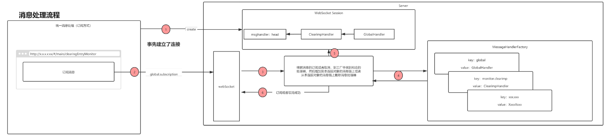
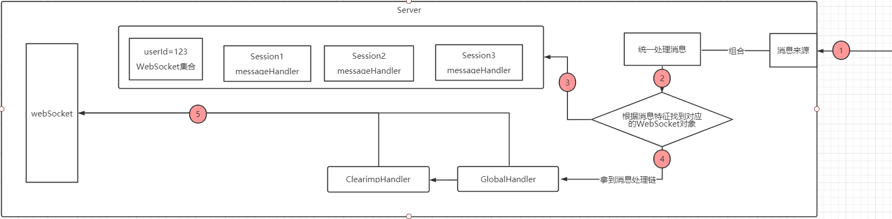

# websocket demo

此demo是一个前端向后端订阅一种消息后，后端如果有该消息就会推送给前端
所使用的技术栈有：WebSocket协议，设计模式含有建造者模式，工厂模式，责任链模式，策略模式，单例模式等

1. 项目运行server模块，默认8080端口
2. `http://www.jsons.cn/websocket/`进入该网页进行WebSocket测试
3. 连接WebSocket，连接为`ws://localhost:8080/websocket/123`，`123`为用户id
4. 发送订阅消息，订阅以后缀`subscription`结尾，取消订阅以`cancel`结尾
5. 具体的可以订阅消息查看消息标签定义枚举(MessageTag)
6. 例如订阅接收全局消息，发送消息(global.subscription)给后台，订阅成功，只要有全局消息都会收到
7. 取消订阅消息，发送(global.cancel)给后台，订阅取消，即使有全局消息，此连接也接收不到


消息订阅与取消订阅的流程如下：


```text
如何所示：
1. 首先建立WebSocket连接，建立成功后会有对应的连接对象会保存在一个Map中，key为用户id，value为连接对象集合。
    该连接对象中维护的有用户id，会话对象，活跃时间等信息。
2. 当用户发起某个消息的订阅时，例如全局消息(global.subscription)，通过事先建立的通信管道传输到服务端，服务端收到后根据消息的内容
    进行相应的处理。
3. 服务器根据收到的消息，此处是字符串，根据后缀来判断此条消息是订阅(subscription)还是取消订阅(cancel)
4. 知道是订阅还是取消订阅后，在将前缀截取出来，然后去工厂中找相应的消息处理器，例如处理全局消息的处理器(GlobalHandler)
5. 将该处理器添加到该连接对象的管理消息处理器的集合中
6. 订阅成功，不会响应客户端
```

消息的处理过程如下：

```text
如图所示
1. 当监听器收到有消息处理时，此监听器需要注入全局消息处理对象，收到消息后根据消息封装成统一的格式后通过消息处理对象统一发送
2. 发送后，全局消息处理对象会根据消息的内容进行广播或者单播，如果单播的话，就在全局维护的连接集合中找到对应的连接对象
3. 然后从连接对象中取出消息管理器集合，发送给消息管理器
4. 消息管理器收到消息后，消息就会在消息管理器中依次处理，如果某个消息管理器能够处理该消息，则该消息管理器直接将消息发送给客户端，然后阻止消息继续向下传递消息
5. 消息通过WebSocket连接传递到客户端
```

详细讲解

消息接收处
```text
    if(message.endsWith(SUBSCRIBE_POSTFIX)){
        MessageHandler handler = MessageHandlerFactory.getHandler(message.substring(0, message.lastIndexOf(".")));
        if(null != handler) {
            this.chain.addHandler(handler);
        }
    }else if (message.endsWith(CANCEL_POSTFIX)){
        MessageHandler handler = MessageHandlerFactory.getHandler(message.substring(0, message.lastIndexOf(".")));
        if(null != handler) {
            this.chain.removeHandler(handler);
        }
    }else{
        this.session.getBasicRemote().sendText("HeartBeat");
    }
```
此处使用了策略模式+工厂模式，利用消息的内容选择不同的策略(订阅、取消订阅和心跳)，然后利用工厂模式根据消息的前缀创建不同的
消息处理器，每个消息处理器只处理它相关的消息。

利用基于接口而非实现编程原则，抽象出一个消息处理接口
```text
public interface MessageHandler {
	boolean handle(WebSocketServer socket, CommonMsg commonMsg);
}
```

具体消息处理器类如下(全局消息处理类，只处理整个系统全局消息)
```text
public class GlobalMsgHandler implements MessageHandler {
	private static volatile GlobalMsgHandler globalMsgHandler;
    // 防止反射创建对象，破坏单例
	private GlobalMsgHandler(){
		if(null != globalMsgHandler){
			throw new RuntimeException("Two instance are not allowed to be created!");
		}
	}
	
	@Override
	public boolean handle(WebSocketServer socket, CommonMsg commonMsg) {
		if(MessageTag.GLOBAL.getTag().equals(commonMsg.getHeaders().get(MessageHeaders.TAG))){
			try {
				socket.getSession().getBasicRemote().sendText(JSONObject.toJSONString(commonMsg));
			} catch (IOException e) {
				e.printStackTrace();
			}
			return false;
		}
		return true;
	}
	// 双重检查锁+防止指令重排的单例模式
	public static GlobalMsgHandler getInstance(){
		if(null == globalMsgHandler){
			synchronized (GlobalMsgHandler.class){
				if(null == globalMsgHandler){
					globalMsgHandler = new GlobalMsgHandler();
				}
			}
		}
		return globalMsgHandler;
	}
	
}
```

注意：
    必须保证每个处理器为单例，否则在取消订阅的时候会出现问题


在消息处理处
```text
public class WebSocketServer {
    /** 消息处理器 */
    private final MessageHandlerChain chain = new MessageHandlerChain();
    ....

    public void sendMessage(CommonMsg commonMsg) throws IOException {
        this.chain.handle(this, commonMsg);
    }

    ....
}
```
此处使用了责任链模式，后台检测到消息后通过统一的格式和内容发送到指定的连接处，也就是此处的sendMessage方法，然后该方法
将消息发送给MessageHandlerChain，而该对象中维护了一个消息处理器集合，通过handle方法遍历所有消息处理器依次处理消息，如果
消息处理了直接中断阻止消息继续向下传递，如果所有的处理器都无法处理该消息，则该消息就无法发送到客户端
```text
public class MessageHandlerChain {
    private List<MessageHandler> msgHandlers = new ArrayList<>();

	public void addHandler(MessageHandler handler){
		this.msgHandlers.add(handler);
	}
	public void removeHandler(MessageHandler handler){
		this.msgHandlers.remove(handler);
	}
	// 消息处理
	public void handle(WebSocketServer socket, CommonMsg commonMsg){
		for (MessageHandler msgHandler : this.msgHandlers) {
			if(!msgHandler.handle(socket, commonMsg)){
				break;
			}
		}
	}
}
```

消息的定义格式有CommonMsg来定义，该类使用了构建者模式来构建消息对象
```text
// 缺省很多代码
public class CommonMsg<T> implements Serializable{
	private final MessageHeaders headers;
	private final T body;

    public static BodyBuilder instance() {
        return new DefaultBuilder();
    }

    private static class DefaultBuilder implements BodyBuilder {
		private final MessageHeaders headers = new MessageHeaders();
		@Override
		public <T> CommonMsg<T> build() {
			return body(null);
		}
		@Override
		public <T> CommonMsg<T> body(T body) {
			return new CommonMsg<>(this.headers, body);
		}
	}
}
```

可以看出，消息的模型类似于HTTP协议定义的格式，MessageHeaders中定义消息的属性，body就保存要传递的消息
该类构造对象时通过静态方法`instance()`构造一个`DefaultBuilder`对象，然后在通过此对象的`build()`方法构造一个空的
CommonMsg对象，此构造过程就属于建造者模式，例如`CommonMsg.instance().build()`

而消息的一些属性定义在MessageHeaders类中，例如，消息类型，消息标签，消息主要内容(摘要)，消息的授权等等...
该定义不能经常改，所以在事先做好消息定义
```text
public class MessageHeaders implements Map<String, String>, Serializable {
	final Map<String, String> headers;
	/** message type */
	public static final String TYPE = "Type";
	/** message tag */
	public static final String TAG = "Tag";
	/** message ownership module */
	public static final String CONTENT = "Content";
	/** message auth */
	public static final String AUTH = "Auth";
    
    ...
}
```

消息的类型等各种固定值可以通过枚举类来定义
例如消息分类，消息标签等
```text
// 消息类型
public enum  MessageType {
	NOTICE("notice"),
	LOG("log"),
	INFO("info"),
	CHAT("chat"),
	ADVERTISE("advertise");
}

// 消息标签：类似于消息产生的具体业务范围
public enum MessageTag {
	GLOBAL("global"),
	SETTLEMENT_CLEARIMP("settlement.clearimp");
}
```

定义全局的消息发送入口
```text
@Component
public class MessageConsumer {
	public void send(CommonMsg commonMsg){
		Map<String, List<WebSocketServer>> socket = WebSocketServer.getSocket();
		// broadcast - 广播
		if(null == commonMsg.getHeaders().get(MessageHeaders.AUTH)){
			socket.values().stream().forEach(item -> {
				item.stream().forEach(one -> {
					try {
						one.sendMessage(commonMsg);
					} catch (IOException e) {
						e.printStackTrace();
					}
				});
			});
		}

		// unicast - 单播（发送给某个用户
		else {
			String uid = commonMsg.getHeaders().get(MessageHeaders.AUTH);
			socket.get(uid).stream().forEach(one -> {
				try {
					one.sendMessage(commonMsg);
				} catch (IOException e) {
					e.printStackTrace();
				}
			});
		}
	}
}
```
如果某个监听器或者某个类有消息发送给客户端，则只需要使用注解@Autowaird 注入该对象，然后使用messageConsumer.send(commonMsg)
即可将消息发送出去，具体客户端收不收到，还需要看他是否订阅该类消息